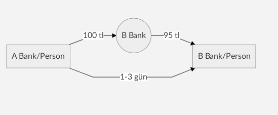
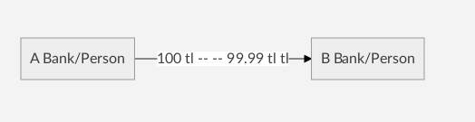
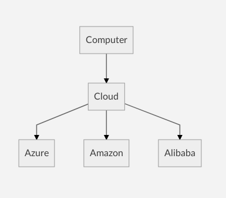
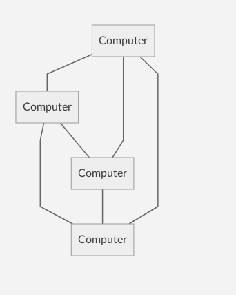

# Peer-to-Peer (P2P) 

İki yada daha fazla istemci arasında veri paylaşmak için kullanılan bir **ağ protokolüdür**.

- Tek seferde bir veriyi milyonlarca kişiye gönderme.
- **[ICQ](https://icq.com/)** bilgisayarlar arasında bağlantı olmadan mesajlaşmayı sağlayan ilk programdır.
- P2P ni ilk örneği **[Napster](https://us.napster.com/)** dır.

# Blokchain

**Önceden**

  

- Satoshi bu alt yapıyı ortaya çıkarmadan önce birine para göndereceğimizde ilk olarak parayı bankaya gönderiyoruz. Sonra banka belli bir kesintiyle belli bir sürede göndermek istediğimiz yere ulaşıyor. Burada hem zaman hem de para kesintisiyle para kaybı yaşıyorduk.

**Satoshi Nakamoto dan sonra**

  

- Satoshi Nakamoto geliştirdiği bu teknolojiyle aradan bankayı kaldırdı. Aradan bankanın kalkmasıyla bekleme süreside kalkmış oldu. Gerçekleştireceğimiz bir işlemi beklemeden gerçekleştirebiliyoruz. Ayrıca bankaların yaptı kesintide hatrı sayılır derecede düştü. Hem zaman hem de para kaybı ortadan kalmış oldu.

# Blockchain 

- Bilgi tutan protokol.
- Adresler biliniyorsa herkes herkesi takip edebilir.
- Adreslerin isim karşılığı yoktur.
- İşlene veri değiştirilemez.
- Herşey kayıt altında tutulur.
- Proof of work (ödül mekanizmasıyla verilerin doğruluğunu kontrol etme)
- Proof of stake (farklı bir doğrulama yöntemi)

**Hash(sha256)** **Asymetric keys(rsa512)** gibi şifreleme yöntemleri kullanılır.

# Ethereum

- Merkezi olmayan bilgisayar.

- Quorum -> J.P.Morgen : Blockchain alanında bağımsız bir şirket.

**Klasik internet iletişimi**

  

**Ethereum iletişimi**

  

**Merkezi olmayan uygulamalar**
- Güvenli
- Seffaf
- Aracısız
- Tek bir noktadan yönetilmeyen

**Akıllı kontratlar**

- 24 Byte adres
- State : İşlem bilgilerinin tutulduğu alan.(Eski bilgiler değiştirilemez.)

# Solidity

- Ethereum Virtual Machine
- remix.ethereum.org
- metamask
- rinkeby.etherscan.io : contact adres kontrolü
